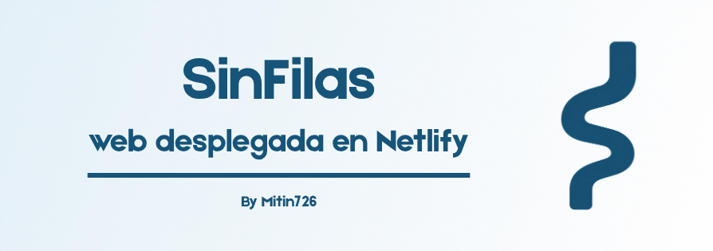

# SinFilas — Landing Page
<br>
🔗 **Sitio en vivo:** https://sinfilas.netlify.app/

## ¿Qué es esto?

Esta es la página web que hice para presentar el proyecto **SinFilas**. Su propósito es explicar, de forma simple y cercana, el problema que busco resolver y presentar a **Alba**, el asistente virtual de Telegram que desarrollé como solución.

No es una aplicación con funcionalidad propia: es una landing page informativa, pensada como material de apoyo para dar a conocer el proyecto y dirigir a las personas hacia Alba para que puedan probarla directamente.

## El problema que presento

Muchas personas, especialmente adultas mayores o con movilidad reducida, hacen largas filas en farmacias o centros de salud para reclamar un medicamento, y al llegar su turno descubren que no hay disponibilidad. Esto genera pérdida de tiempo, desgaste físico y frustración, sobre todo cuando el desplazamiento pudo evitarse.

## La solución que presento

La idea es simple: permitir que la persona consulte la disponibilidad de un medicamento **antes de salir de casa**, escribiéndole a Alba por Telegram como si fuera un mensaje de texto normal. En segundos, Alba responde si el medicamento está disponible, evitando así el viaje y la fila si no lo está.

## Contenido de la página

La web está organizada en una sola página con scroll, dividida en estas secciones:

1. **Hero** — presentación del problema y llamado a la acción inicial
2. **El problema** — explicación de las filas y desplazamientos innecesarios
3. **La solución** — la idea general antes de presentar a Alba
4. **Conoce a Alba** — presentación del asistente virtual, con enlace directo para hablarle por Telegram
5. **Cómo funciona** — 3 pasos simples de uso
6. **Llamado a la acción final** — invitación a hablar con Alba
7. **Footer** — información de contacto y enlace a Telegram

El diseño está pensado especialmente para personas adultas mayores: texto grande, alto contraste, lenguaje simple sin tecnicismos, y botones grandes y claros.

## Tecnologías usadas

- **HTML5** semántico
- **CSS3** (variables CSS, Flexbox/Grid, diseño responsive mobile-first)
- **JavaScript** (vanilla, sin frameworks)
- Desplegado en **Netlify**, con actualización automática cada vez que se sube un cambio al repositorio

## Cómo probar el bot desde la web

En varias secciones de la página hay botones que dicen **"Habla con Alba"**, los cuales redirigen directamente al chat de Telegram del bot: `https://t.me/medicamentos_alba_bot`.

**Importante:** Alba solo responde mientras el bot esté corriendo activamente desde el equipo donde se ejecuta el proyecto (ver el README del bot). Al ser un prototipo, no está desplegado en un servidor permanente, así que puede que en algún momento el bot no responda si no está encendido.

## Estructura del proyecto

```
sinfilas-web/
├── index.html
├── css/
│   └── styles.css
├── js/
│   └── main.js
└── images/
    ├── logo_sinfilas.png
    ├── alba_perfil.png
    └── solucion_ilustracion.png
```

## Estado actual del proyecto

Este es un prototipo funcional, hecho como parte de la presentación (pitch) del proyecto SinFilas, con el objetivo de comunicar el problema, la solución y dar a conocer a Alba de forma visual y profesional.

Made with ❤️ by Mitin726